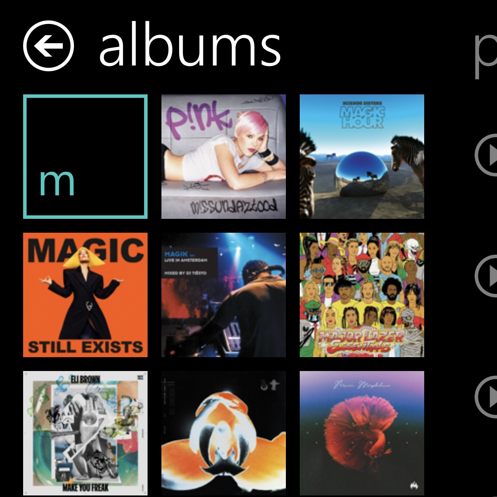

<!-- One -->
<section id="one" class="wrapper style2 special">
	<header class="major">
		

		<h2>2009 &ndash; 2023</h2>
		
In 2009, I embarked on a project to learn iOS development, and set out to bring the Metro experience to iOS. Unsatisfied with the results at the time, I shelved the project indefinitely. In 2022, with years of professional development experience under my belt, I revisited the project, and I feel that I've finally been able to do it justice. Today, I'm thrilled to share turntable with you, and I hope you'll enjoy using it as much as I enjoyed creating it.

	

	</header>
</section>

<!-- Two -->
<section id="two" class="wrapper">
	

		<section class="spotlight">
			

			

				<h3>about the app</h3>
				
Handmade in Tokyo, Japan, turntable brings a sleek design and intuitive user interface to your favorite music. Enjoy listening with your album artwork front and center.

			

		</section>
		<section class="spotlight">
			

			

				<h3>make it yours</h3>
				
Demand attention to detail. turntable is designed with customization and accessibility in mind! Adjust text sizes for enhanced readability, choose your favorite color to apply across the entire app for a truly unique and personal touch, or change the language to Japanese or Korean.

			

		</section>
		<section class="spotlight">
			

			

				<h3>your content on show</h3>
				
Let your music take the stage. In turntable, your music's album artwork is front and center on the main menu, and in the music library.

			

		</section>
		<section class="spotlight">
			

			

				<h3>behind the code</h3>
				
Ben Johnson is a Senior Software Engineer based in Tokyo with a passion for music, coffee, and rescue dogs. In his free time, he enjoys working on personal app projects both for fun and for self-improvement. He tends to stand out a little, and exudes creative energy with his bright neon hair.

			

		</section>
	

</section>
